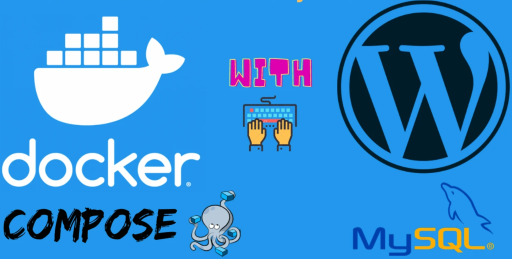

# Creating a Website with WordPress and MySQL using Docker: A Docker Stack Application

## I have created a Docker stack application using Docker to build a WordPress application. This stack includes WordPress and MySQL services and deploys them. The MySQL database is configured using secret passwords and information stored securely. The WordPress service provides a website by connecting to the MySQL database. This Docker stack can be used to deploy the application quickly and in a reproducible manner.

In the above `docker-compose.yml` file, we have defined a MySQL database service named `db` and a WordPress service named `wordpress`. These services are connected to the same network (`webnet`).

MySQL service (`db`):
- It uses the `mysql:5.7` image.
- A Docker volume named `db_data` is created to store the MySQL database's data.
- `restart: always` ensures that the service automatically restarts.
- The `environment` section specifies the necessary environment variables and file paths for the MySQL database. These variables refer to the secret data defined in the `secrets` section (`db_root_password`, `db_name`, `db_user`, `db_password`).
- In the `secrets` section, the file paths for the secret data are specified. These secret data will be read from the `db_root_password.txt`, `db_name.txt`, `db_user.txt`, and `db_password.txt` files located in the same directory.

WordPress service (`wordpress`):
- The `depends_on` ensures that this service waits for the MySQL service to be up and running.
- It uses the `wordpress:latest` image.
- The `ports` section forwards the WordPress service to the outside world through port 80.
- `restart: always` ensures that the service automatically restarts.
- The `environment` section specifies the necessary variables and file paths for WordPress to connect to the MySQL database. These variables refer to the secret data defined in the `secrets` section (`db_name`, `db_user`, `db_password`).
- In the `secrets` section, the file paths for the secret data are specified. These secret data will be read from the `db_name.txt`, `db_user.txt`, and `db_password.txt` files located in the same directory.

Secrets (`secrets`):
- Four different secret data are defined: `db_root_password`, `db_name`, `db_user`, and `db_password`.
- The `file` section specifies which files the secret data should be read from. In this example, the secret data will be read from the `db_root_password.txt`, `db_name.txt`, `db_user.txt`, and `db_password.txt` files.

Network (`networks`):
- An overlay network named `webnet` is defined. This network allows services to communicate with each other.

To start the Docker stack, you can use the `docker-compose up -d` command in the terminal. This command will deploy the services using the `docker-compose.yml` file.